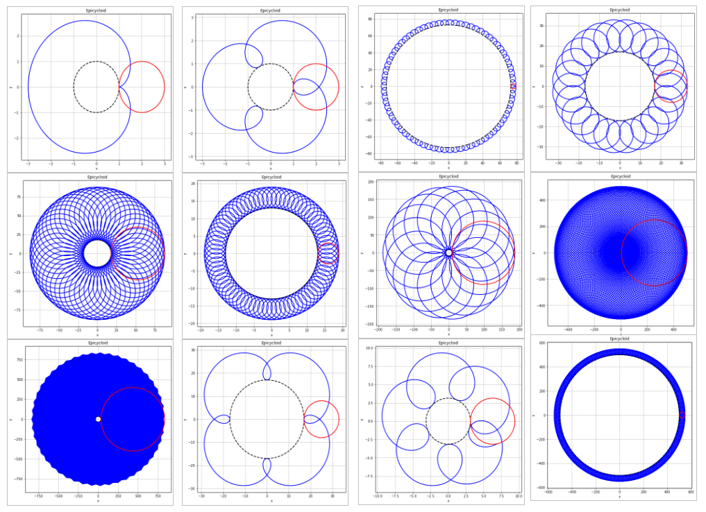
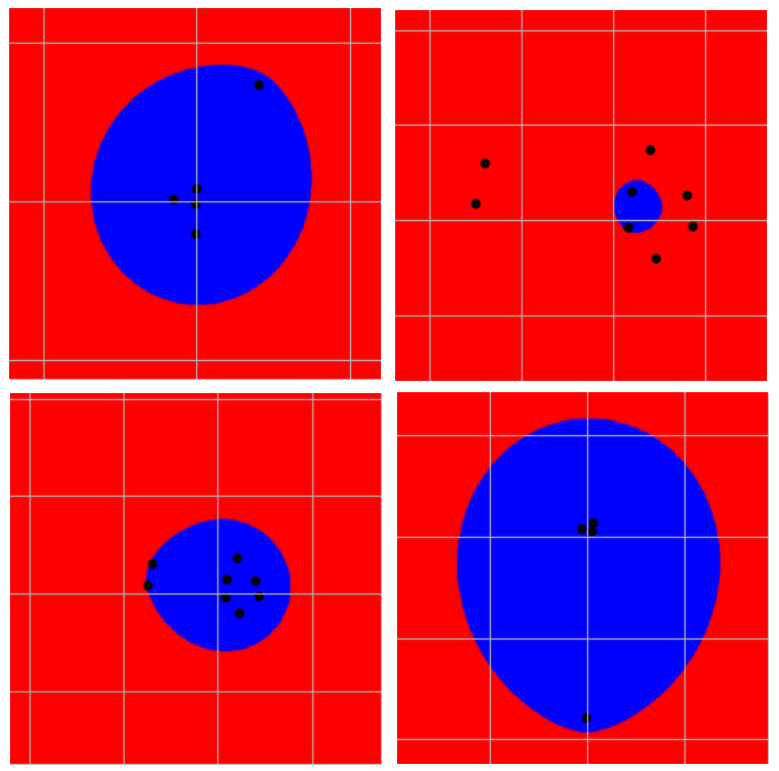

# Parametric_Curves

Epicycloid curve generation driven by user input and multi-focal ellipse computation using the Monte Carlo method.

### Gallery of epicycloids

  

 
 
 

### A few interesting n ellipses:

  

